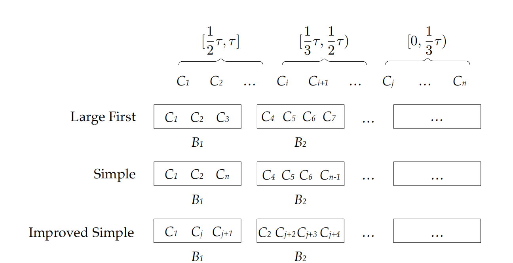

# Graph Diversity Optimization Project

This project contains three main components for graph diversity optimization:

1. **Exact Algorithm (`exact`)** – implemented in **C++**
2. **Greedy Algorithms (`greedy`)** – three heuristic approaches, implemented in **C++**
3. **Reinforcement Learning (`RL`)** – an A2C-based method, implemented in **Python + PyTorch**

---

## 🔹 Exact Algorithm (`exact`)

### File

`diversity_exact.cpp`

### Language

C++ (tested with GCC 8+)

### Overview

The exact method computes the **maximum diversity improvement** by exploring all possibilities with a **Branch-and-Bound (BnB) algorithm**.
It guarantees **optimal solutions** under the given parameters:

* Graph file (`graph.txt`)
* Threshold \$\tau\$ (minimum connected component size to count as "qualified")
* Budget \$b\$ (maximum number of edges allowed to add)
* Query nodes (from `test_queries.txt`)

### Key Components

* **Union-Find (DSU)**: maintains connected components
* **Graph Reader**: loads graph, compresses node IDs, builds adjacency list
* **Neighbor Subgraph Builder**: extracts query node’s neighbor subgraph
* **Connected Components Search**: BFS/DFS to enumerate components
* **Branch-and-Bound**: recursively partitions components into groups to maximize diversity score

### Input

1. **Graph file** (edge list, e.g.)

   ```
   1 2
   2 3
   3 4
   ... ...
   ```
2. **Query file** (`test_queries.txt`)

   We randomly choose 100 nodes to use for testing.

   ```
   12
   45
   78
   ...
   ```

### Usage

Compile:

```bash
g++ -O2 diversity_exact.cpp -o exact
```

Run:

```bash
./exact <graph.txt> <tau> <b> --test test_queries.txt
```

**Optional arguments**:

* `--trials T` : number of trials (default = 1)
* `--seed S` : random seed (default = 42)
* `--query ID` : specify single query node

### Output

Results are written to:

```
<graph.txt>_exact_result.txt
```

Each query result includes:

```
query_id   q0   q_new   inc   edge_num   edge_list
```

At the end of the file, global statistics are appended:

* Sum of diversity gain
* Total runtime (ms)

---

## 🔹 Greedy Algorithms (`greedy`)

### File

`greedy.cpp`

### Language

C++ (tested with GCC 8+, C++14)

### Overview

This module provides **three heuristic greedy algorithms** to approximate the diversity improvement:

1. **Next Fit (NF)** – sorted and packs components sequentially until the threshold $\\tau$ is reached.
2. **Simple (SI)** – sorted and packs components using the shortest prefix and fills from the tail.
3. **Improved Simple (ISI)** – a more refined grouping method using size-based partitioning.



Although they **do not guarantee optimal solutions**, they are **much faster** than the exact BnB approach, making them suitable for large graphs.

### Key Components

* **Graph Reader**: reads graph, compresses node IDs, builds adjacency list
* **Neighbor Subgraph Extraction**: builds subgraph of neighbors for each query node
* **Connected Components**: computes components within the neighbor subgraph
* **Greedy Packing**:

  * NF, SI, ISI grouping strategies
  * Plan edges within budget \$b\$
* **Result Writer**: logs query results and summary statistics

### Input

1. **Graph file** (edge list)
2. **Query file** (e.g., `test.txt`) – same format as Exact, we randomly choose 100 nodes to use for testing

### Usage

Compile:

```bash
g++ -std=c++14 -O2 -Wall -Wextra -o greedy greedy.cpp
```

Run:

```bash
./greedy <graph.txt> <tau> <b> <method> --test <test.txt> [--seed S] [--trials T]
```

**Optional arguments**:

* `<graph.txt>` : input graph file
* `<tau>` : threshold (minimum component size to count as qualified)
* `<b>` : budget (max number of edges to add)
* `<method>` : choose greedy algorithm

  * `1` = Next Fit (NF)
  * `2` = Simple (SI)
  * `3` = Improved Simple (ISI)
* `--test file` : test query file
* `--seed S` : random seed (default = 42)
* `--trials T` : number of trials (default = 1)
* `--query ID` : specify single query node (instead of reading test file)

### Output

Results are written to:

```
<graph.txt>_Greedy_<method>_result.txt
```

Each query result includes:

```
Query <id> q0=<initial> new_q=<final> increase=<delta> time_us=<runtime>
```

At the end, global statistics are appended:

* Total diversity increase
* Total runtime (ms)

---

## 🔹 Reinforcement Learning (`RL`)

### Files

`main.py`
`algorithm.py`
`args.py`
`environment.py`
`model_a2c.py`
`utils.py`

### Language

Python 3.7+ + PyTorch 2.1.0

### Overview

This module uses an **A2C-based RL method** to maximize diversity in graphs.

### Input

* Graph file (`graph.txt`)
* Query file for training (`training_query.txt`) – we randomly choose 400 nodes to use for training
* Query file for testing (`testing_query.txt`) – we randomly choose 100 nodes to use for testing
* Budget \$b\$ and threshold \$\tau\$

**Optional arguments**:

* `--budget` : maximum number of edges allowed to add
* `--train_epochs` : number of training epochs
* `--emb_dim` : embedding dimension
* `--hidden` : hidden layer size
* `--lr` : learning rate
* `--gamma` : discount factor
* `--ent_coef` : entropy coefficient
* `--value_coef` : value loss coefficient
* `--n_step` : n-step return for A2C
* `--device` : 'cpu' or 'cuda'
* `--seed` : random seed
* `--out_dir` : directory to save results and models
* `--save_path` : path to save trained model
* `--query` : specify a single query node for evaluation (optional)

### Usage

```bash
python main.py --graph graph.txt --tau <tau> --budget <b> --train training_query.txt --test testing_query.txt [--query ID] [--seed S]
```

### Output

* Logs training progress and results per query node
* Saves model checkpoints and final diversity metrics
* Summary statistics include total diversity increase and runtime
